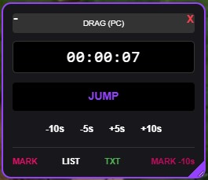
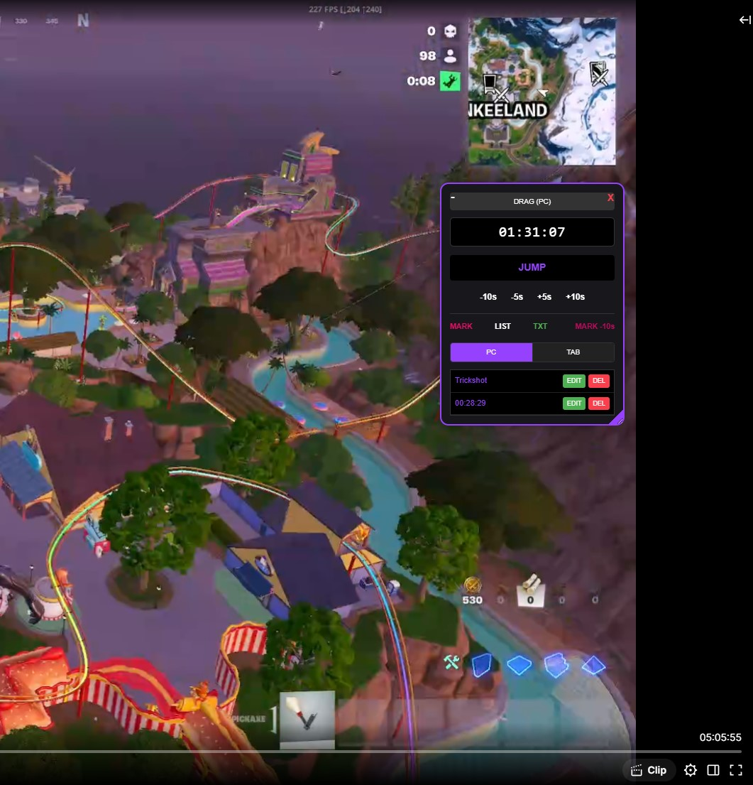
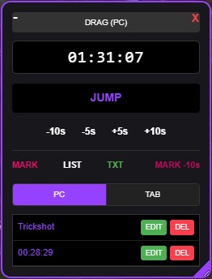
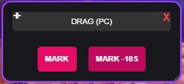
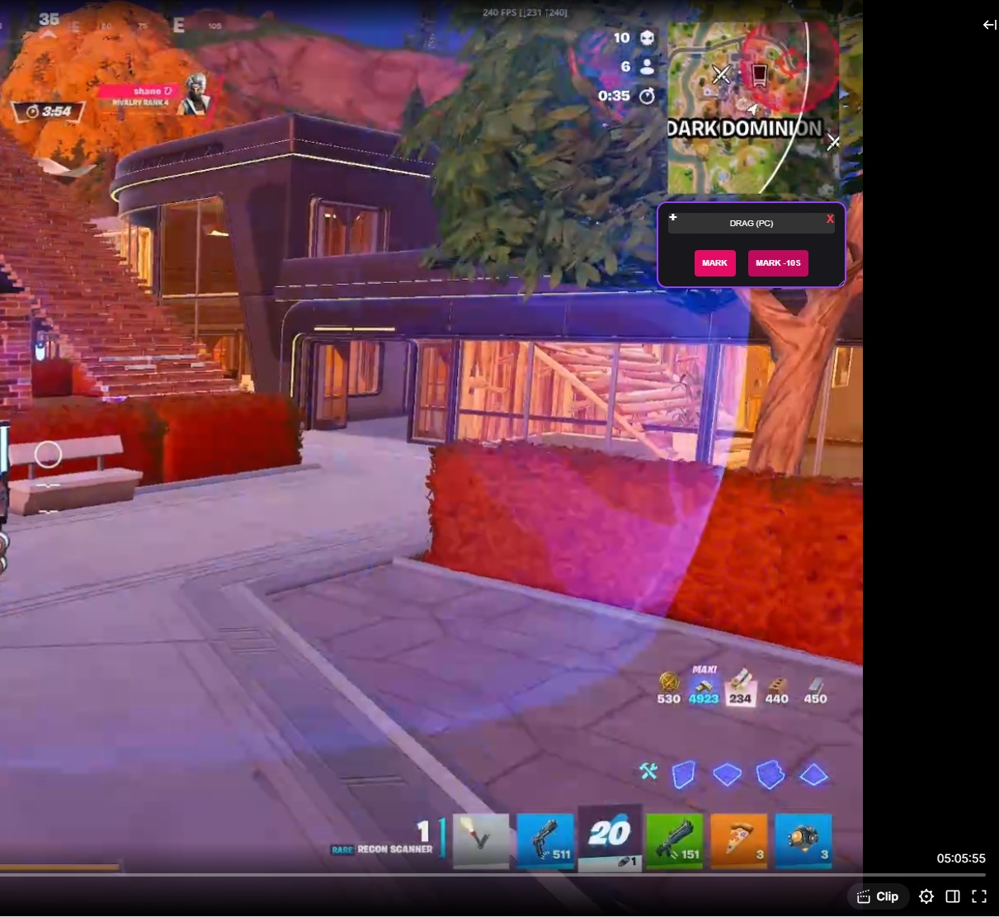
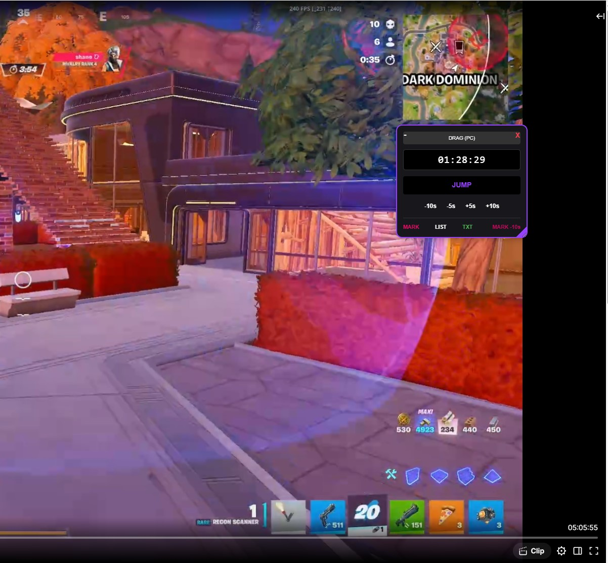

# 🚀 TwitchJumpSync 
Jump to precise moments in VODs and save your favorite highlights with the MARK function to watch them again later.

### 📸 Aperçu de l'application

.mp4)

| | | |
| :---: | :---: | :---: |
|  |  |  |
|  |  |  |

- Quick Start Guide -

This script synchronizes your Twitch moments across your devices via your own private database.

## 🛠️ Step 1: Create your "Server" (Firebase)
1. Go to [Firebase Console](https://console.firebase.google.com/).
2. Create a project named **TwitchSync**.
3. In the left-hand menu, go to **Realtime Database** > **Create**.
4. Choose **"Start in test mode"** (important so your devices can write data).
5. Go to **Project Settings** (gear icon) > **General**.
6. Click the `</>` icon to create a Web App. 
7. Copy the codes (`apiKey`, `databaseURL`, etc.) that appear.

## 💻 Step 2: Installation on PC
1. Install the **Tampermonkey** extension.
2. Click the **"Raw"** button at the top right of this repo to install the script.
3. Go to Twitch, a configuration window will appear: paste your Firebase codes and save.

## 📱 Step 3: Installation on Android (Tablet/Mobile)
1. Install **FIREFOX NIGHTLY**.
2. In **FIREFOX NIGHTLY**, install the **Tampermonkey** extension.
3. Open this Gist in **FIREFOX NIGHTLY**, click the **"Raw"** button and install.
4. On Twitch within Firefox Nightly on your tablet, enter **the same Firebase codes** as on PC.

---
**💡 Usage:** Click **MARK** to save a moment. Click **LIST** to view your saves and switch between devices using the **PC/TAB** tabs.

French : 

# 🚀 TwitchJumpSync - Guide de démarrage rapide

Ce script synchronise vos moments Twitch entre vos appareils via votre propre base de données privée.

## 🛠️ Étape 1 : Créer votre "Serveur" (Firebase)
1. Allez sur [Firebase Console](https://console.firebase.google.com/).
2. Créez un projet nommé **TwitchSync**.
3. Dans le menu de gauche, allez dans **Bases de données Realtime Database** > **Créer**.
4. Choisissez **"Démarrer en mode test"** (important pour que vos appareils puissent écrire).
5. Allez dans les **Paramètres du projet** (icône roue dentée) > **Général**.
6. Cliquez sur l'icône `</>` pour créer une Web App. 
7. Copiez les codes (`apiKey`, `databaseURL`, etc.) qui s'affichent.

## 💻 Étape 2 : Installation sur PC
1. Installez l'extension **Tampermonkey**.
2. Cliquez sur le bouton **"Raw"** en haut de ce repo pour installer le script.
3. Allez sur Twitch, une fenêtre de configuration apparaîtra : collez vos codes Firebase et enregistrez.

## 📱 Étape 3 : Installation sur Android (Tablette/Mobile)
1. Installez FIREFOX NIGHTLY.
2. Dans FIREFOX NIGHTLY, installez l'extension **Tampermonkey**.
3. Ouvrez ce Gist dans FIREFOX NIGHTLY, cliquez sur **"Raw"** et installez.
4. Sur Twitch dans Firefox Nigthly de votre tablette, entrez **les mêmes codes Firebase** que sur PC.

---
**💡 Utilisation :** Cliquez sur **MARK** pour sauvegarder un instant. Cliquez sur **LIST** pour voir vos sauvegardes et passer d'un appareil à l'autre via les onglets **PC/TAB**.
